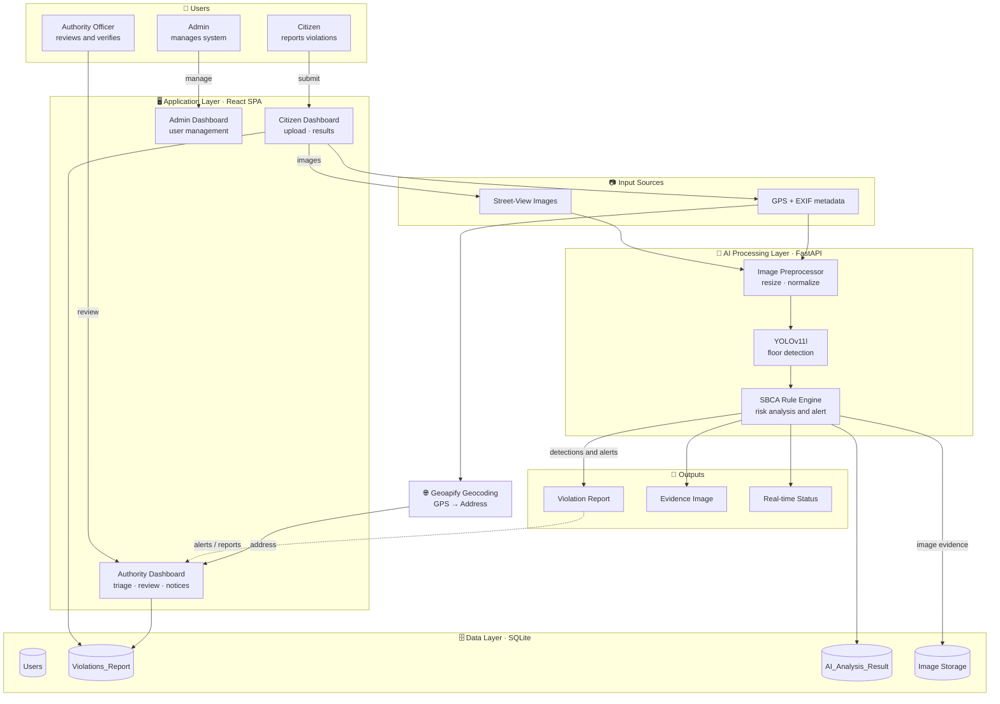

# AI-Powered Construction Violation Detection

> An enhanced monitoring system for the **Sindh Building Control Authority (SBCA)** that automates the detection of building by-law violations — such as unauthorised extra floors — from street-view imagery using deep-learning object detection.

<p align="left">
  
  
  
  
  
  
  
</p>

A full-stack web application that lets citizens report suspected construction violations, screens each report with a custom-trained **YOLOv11** floor-detection model, checks the result against per-district SBCA zoning rules, and routes flagged cases to the relevant authority with map context and a printable notice.

---

## Table of contents

- [Overview](#overview)
- [⭐ My contribution (ML / Computer Vision)](#-my-contribution-ml--computer-vision)
- [Features](#features)
- [Architecture](#architecture)
- [Tech stack](#tech-stack)
- [Screenshots](#screenshots)
- [Getting started](#getting-started)
- [Configuration](#configuration)
- [Deployment](#deployment)
- [Project structure](#project-structure)
- [Roadmap](#roadmap)
- [Team & contributions](#team--contributions)
- [License](#license)

---

## Overview

Unauthorised construction — most commonly **extra floors beyond the sanctioned limit** — is difficult for a regulatory body to monitor manually at city scale. This project gives the SBCA an end-to-end pipeline:

1. A **citizen** uploads a street-view photo of a building and selects its district (GPS/EXIF is read automatically when available).
2. The image is analysed by a **YOLOv11 floor-detection model**; the number of detected floors is compared against the district's permitted maximum by an **SBCA rule engine**.
3. If the floor count exceeds the limit, the report is flagged as a violation, stored with annotated **evidence imagery**, and surfaced to the **authority** dashboard with a map view and a **printable notice**.
4. Citizens can track their complaint's status with a generated **tracking ID**.

Aerial imagery (for setback/encroachment analysis) is recognised and routed to manual review until a dedicated aerial model is added.

---

## ⭐ My contribution (ML / Computer Vision)

> This is a team final-year project. **My individual contribution was the data and the model** — sourcing and curating the dataset, annotating it, and training & evaluating the floor-detection model that powers the AI screening layer. The full ML pipeline is documented in **[`training/README.md`](training/README.md)**.

**Data collection & annotation**

- Collected **4,500 candidate images** from multiple sources, then **screened them for usability** (clear façades, visible floor lines, varied lighting/angles).
- **Annotated 1,090 images** in **[Roboflow](https://roboflow.com/)** for a single `floor` class, producing **4,015 floor instances** across train/val/test splits.

**Modelling**

- Normalised Roboflow's mixed bounding-box + polygon export into clean **detection** labels (a deliberate choice — the export is ~98% rectangles, so box mAP is the meaningful metric).
- Ran a **pre-flight data audit** and a fast **yolo11n smoke test** to predict the achievable ceiling *before* committing to a long run.
- Trained **`yolo11l`** at `imgsz=960` for 150 epochs (AdamW + cosine LR, mosaic/mixup augmentation) on **2× NVIDIA T4** GPUs.

**Results (held-out test set)**

| Metric | Score |
| :--- | :---: |
| **mAP@50** | **0.933** |
| mAP@50–95 | 0.629 |
| Precision | 0.906 |
| Recall | 0.897 |

The trained weights (`best_floor.pt`) are consumed in production by [`backend/services/ai_service.py`](backend/services/ai_service.py).

<!-- Add a grid of annotated YOLO predictions here. Suggested file: docs/screenshots/model_predictions.png -->


📄 **Full write-up:** [`training/README.md`](training/README.md) · 📓 **Notebook:** [`training/floor_detection_yolov11.ipynb`](training/floor_detection_yolov11.ipynb)

---

## Features

**Citizen**
- Guided reporting wizard: select district → upload street-view image → automatic analysis → result.
- Automatic GPS extraction from image EXIF metadata.
- Public complaint tracking by tracking ID — no login required.

**Authority**
- Map dashboard (Leaflet) of reports scoped to the officer's assigned area.
- Triage and review queue with AI verdict, detected floor count, and annotated evidence.
- One-click **printable violation notice** generation (HTML templates).

**Admin**
- User management (create / edit / list authority accounts) and area assignment.

**AI & rules**
- YOLOv11l floor detection on street-view uploads with annotated evidence output.
- District-aware **SBCA rule engine** (per-district floor limits and setback requirements).
- Aerial uploads detected and routed to manual review.

**Platform**
- JWT authentication, role-based access (Citizen / Authority / Admin), and API rate limiting.
- Reverse geocoding (GPS → address) via Geoapify.
- Runs as a containerised web service **or** as a self-contained Windows desktop app.

---

## Architecture



> 🎨 A styled version of this diagram can be added at `docs/architecture.png` and embedded here in place of (or alongside) the Mermaid diagram above.


---

## Tech stack

| Layer | Technologies |
| :--- | :--- |
| **Frontend** | React 18, TypeScript, Vite, Tailwind CSS, React Router, Zustand, Axios, Leaflet / React-Leaflet, Recharts, react-dropzone, exifr |
| **Backend** | FastAPI, Uvicorn, SQLAlchemy 2, Alembic, Pydantic v2, python-jose (JWT), passlib/bcrypt, SlowAPI (rate limiting), Jinja2, Pillow, Shapely |
| **ML / CV** | Ultralytics **YOLOv11l**, Roboflow (annotation), trained on Kaggle (2× T4) |
| **Database** | SQLite |
| **External** | Geoapify (reverse geocoding) |
| **Deployment** | Docker (multi-stage), Render.com, PyInstaller (Windows desktop bundle) |

---

## Screenshots

> 📸 Screenshots are referenced directly by filename — drop the images into `docs/screenshots/` and they will appear here.

<table>
  <tr>
    <td width="50%"><br/><sub><b>home_page.png</b> — Landing page & complaint tracking</sub></td>
    <td width="50%"><br/><sub><b>citizen_report.png</b> — Citizen reporting wizard (district + upload)</sub></td>
  </tr>
  <tr>
    <td width="50%"><br/><sub><b>citizen_result.png</b> — AI result: detected floors & verdict</sub></td>
    <td width="50%"><br/><sub><b>authority_dashboard.png</b> — Authority map dashboard</sub></td>
  </tr>
  <tr>
    <td width="50%"><br/><sub><b>authority_report_detail.png</b> — Report detail + printable notice</sub></td>
    <td width="50%"><br/><sub><b>admin_users.png</b> — Admin user management</sub></td>
  </tr>
</table>

---

## Getting started

**Prerequisites:** Python 3.12+, Node.js 20+.

### 1. Backend (FastAPI)

```bash
cd backend
python -m venv venv
source venv/bin/activate          # Windows: venv\Scripts\activate
pip install -r requirements.txt

# Configure environment (see Configuration below)
cp .env.example .env              # then edit SECRET_KEY, etc.

# Seed a default admin account (username: admin / password: Admin@1234 — change after first login)
python seed.py

# Run the API (http://127.0.0.1:8000, docs at /docs)
uvicorn main:app --reload
```

> For a quick local run without setting a secret, export `VIOSCAN_DEV_DEFAULT_SECRET=1` (development only — never in production).

### 2. Frontend (React + Vite)

```bash
cd frontend
npm install
npm run dev                       # http://localhost:5173
```

The Vite dev server proxies `/api` and `/uploads` to the backend on port 8000, so no extra configuration is needed in development.

### 3. The model

The trained weights `best_floor.pt` live at the repository root and are loaded automatically by the backend (`AI_STREET_MODEL_PATH` defaults to `../best_floor.pt`). To retrain or reproduce the model, see [`training/README.md`](training/README.md).

---

## Configuration

Backend settings are read from `backend/.env` (see `backend/.env.example`). Key variables:

| Variable | Description | Default |
| :--- | :--- | :--- |
| `SECRET_KEY` | JWT signing key (**required** in production) | — |
| `DATABASE_URL` | SQLAlchemy database URL | `sqlite:///./vioscan.db` |
| `GEOAPIFY_API_KEY` | Geoapify reverse-geocoding key (optional) | — |
| `UPLOAD_DIR` | Where uploaded/annotated images are stored | `./uploads` |
| `MAX_FILE_SIZE_MB` | Max upload size | `10` |
| `AI_STREET_MODEL_PATH` | Path to the YOLO weights | `../best_floor.pt` |
| `AI_STREET_MODEL_CONFIDENCE` | Inference confidence threshold | `0.15` |
| `AI_STREET_MODEL_IOU` | Inference IoU (NMS) threshold | `0.3` |
| `AI_DEVICE` | `cpu`, `cuda`, or `auto` | `cpu` |
| `FRONTEND_URL` | Allowed CORS origin for the SPA | `http://localhost:5173` |
| `NOTICE_REPLY_DAYS` | Days given to respond on printed notices | `7` |

---

## Deployment

**Docker (web service)** — a multi-stage build compiles the React SPA and serves it together with the FastAPI API from a single container:

```bash
docker build -t construction-violation-detection .
docker run -p 8000:8000 -e SECRET_KEY=change-me construction-violation-detection
# App + API served at http://localhost:8000
```

**Render.com** — `render.yaml` provisions the service, a persistent disk for the SQLite DB and uploads, and the AI/secret environment variables.

**Windows desktop** — `backend/run_desktop.py` runs the API + SPA as a single process and opens a browser; `scripts/build_exe.ps1` packages it into a standalone `.exe` via PyInstaller.

---

## Project structure

```
.
├── backend/                 # FastAPI service
│   ├── core/                # config, security, rate limiting, districts
│   ├── models/              # SQLAlchemy models (User, Report, AI result)
│   ├── routers/             # auth, citizen, authority, admin, geocoding
│   ├── schemas/             # Pydantic schemas
│   ├── services/            # ai_service (YOLO), rule_engine, geocoding, ...
│   ├── templates/           # printable notice / report HTML
│   ├── main.py              # app entrypoint
│   ├── seed.py              # seed default admin
│   └── run_desktop.py       # desktop (PyInstaller) entrypoint
├── frontend/                # React + TypeScript + Vite SPA
│   └── src/                 # pages (citizen/authority/admin), components, api, store
├── training/                # ML pipeline (data prep, training, evaluation)
│   ├── README.md            # full ML write-up
│   └── floor_detection_yolov11.ipynb
├── docs/                    # diagrams & screenshots
├── best_floor.pt            # trained YOLOv11l weights
├── Dockerfile               # multi-stage build (SPA + API)
└── render.yaml              # Render.com deployment
```

---

## Roadmap

- [ ] Dedicated **aerial model** for setback/encroachment detection (currently routed to manual review).
- [ ] Replace the illustrative district rule values in the rule engine with **official SBCA zoning data**.
- [ ] Expand and re-balance the dataset with more districts and lighting/angle variety.
- [ ] Export the model to ONNX/TensorRT for faster CPU/edge inference.

---

## Team & contributions

This was a **team final-year project**.

- **Muhammad Wajih Hyder** — Machine Learning / Computer Vision: dataset collection & curation, annotation (Roboflow), and YOLOv11 model training, evaluation, and integration. _(See [⭐ My contribution](#-my-contribution-ml--computer-vision).)_
- **Project team** — the rest of the application: frontend (React SPA), backend (FastAPI services, auth, rule engine, geocoding, notices), database, and deployment.

---

## License

Released under the [MIT License](LICENSE).

The training dataset was annotated and exported via Roboflow under **CC BY 4.0**.
