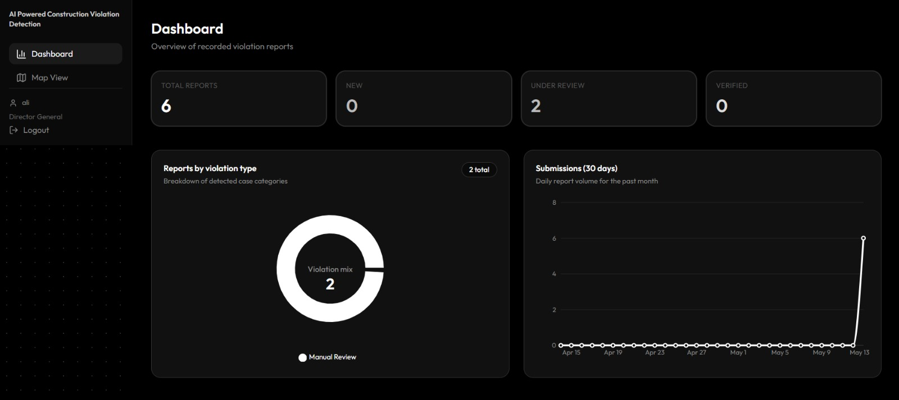
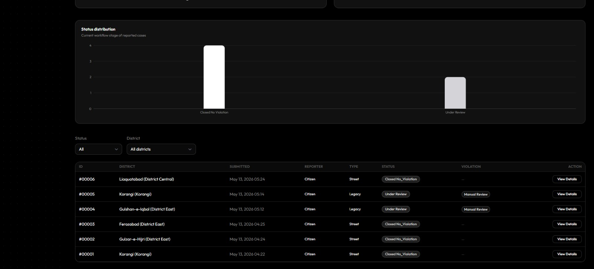

# AI-Powered Construction Violation Detection System

This was our final year project at FAST-NUCES. It started from a real problem the Sindh Building Control Authority (SBCA) has to deal with: people quietly add extra, unauthorised floors to buildings, and there is no practical way to catch that across a city the size of Karachi. So we built a system where anyone can submit a photo of a building, a detection model counts how many floors it has, and that count is checked against the floor limit that actually applies to the area. Anything over the limit gets flagged for the authority to look at.

I worked on the machine learning side of this, the floor-detection model, from collecting the data all the way to the trained weights the backend runs on. The rest of this file is a short overview of the system, and then the part I actually built, in detail.

## What the system does (overview)

A citizen uploads a street photo. The system detects the photo's district from EXIF data or asks the user to select it themselves if it's not found. The backend saves the report, runs the model on the image in the background, and counts the floors it detects. A small rule engine then compares that number to the district's SBCA floor limit and flags the report as a violation or not. The report is saved at the backend with a tracking ID given to the citizen.
Authority users log in to a dashboard, see all the reports specific to their district, open one to review the evidence image, and generate a notice. They approve the  
There's also an admin area for managing the authority accounts.

Underneath, it's a FastAPI backend (SQLite for the database, JWT for auth) and a React + TypeScript frontend, with the model served through Ultralytics. It runs as a normal web app and can also be packaged into a Windows desktop build.

```
Citizen photo ─▶ FastAPI ─▶ floor model (best_floor.pt) ─▶ count floors
                               │
                   district floor limit (rule engine)
                               │
                  violation? ─▶ report shows up on the authority's dashboard
```






## My part: the floor-detection model

### Collecting and annotating the data

There was no ready-made dataset for "floors of a building", so I had to build one. I pulled around **4,500 images** from a mix of sources, then went through them by hand and threw out everything that wasn't usable: blurry shots, angles where you couldn't actually separate the floors, duplicates, images where the building was mostly hidden. What was left, **1,090 images**, I annotated in **Roboflow**, drawing a region around each floor so the model could learn to pick them out individually.

### Looking at the data before committing to a long run

Before burning GPU hours, I went through the dataset properly: how many instances per class, how many floors per image on average, how big the boxes are relative to the image, whether any images had no labels, whether there were tiny boxes that were probably mistakes. I used that to pick the image size and batch size rather than guessing, and to catch labelling problems early. I also ran a short 15-epoch "smoke test" with the small `yolo11n` model first, just to confirm the data was learnable and project roughly where the full run would land before starting it.

### Training

The real run used **YOLOv11-L** (`yolo11l`), which was the best accuracy I could fit on Kaggle's two T4 GPUs at this resolution without running out of memory or overfitting on ~1k images.

- 150 epochs, image size 960, batch 16 split across both GPUs
- AdamW optimiser, cosine learning-rate schedule, early stopping on patience
- Augmentation (mosaic, light mixup, HSV jitter, flips), with mosaic turned off for the last 15 epochs so the model converges on clean images
- Fixed seed so the run is repeatable

### Results

I trained on a 150-epoch budget with early stopping (patience 30). The best checkpoint, the one I exported as `best_floor.pt`, came in around epoch 120 with these validation numbers:

| Metric | Value |
|--------|-------|
| mAP@0.5 | ~0.98 |
| mAP@0.5:0.95 | ~0.67 |
| Precision | ~0.96 |
| Recall | ~0.94 |

These are validation-set figures, measured at the same 960px size I trained at (dropping the resolution at evaluation quietly costs a few mAP points). What I was actually looking for was the *shape* of the curve, not a single lucky epoch: precision and recall climb into the low-0.9s by around epoch 30 and then stay there, which is the stable behaviour you want rather than a spiky one-off peak.


results.csv can be found in training/results.csv

### How the model gets used in the app

I exported the best checkpoint as `best_floor.pt` (it sits at the repo root). The backend loads it once through Ultralytics and, for each uploaded street image, runs inference, counts the floor detections, and saves an annotated copy as the evidence image. That floor count goes to the rule engine, which holds a floor limit per Karachi district and flags an `Extra_Floor` violation when the detected count is over the limit.

### Honest limitations

A few things I'd flag if someone picks this up:

- The floor count is just the number of detections, so it depends on the model cleanly separating stacked floors. Tuning the confidence and NMS IoU thresholds matters here.
- It only handles street-view images. Aerial setback/encroachment checking is stubbed out and would need its own model and dataset.
- The district floor limits in the rule engine are placeholder values; they need to be replaced with the real SBCA zoning numbers.

## Running it

Backend:

```bash
cd backend
pip install -r requirements.txt
uvicorn main:app --reload
```

Frontend:

```bash
cd frontend
npm install
npm run dev
```

The trained model `best_floor.pt` needs to be present where the backend expects it (see `backend/core/config.py`).

## Repository layout

```
best_floor.pt        trained floor-detection weights (YOLOv11-L)
training/            the notebook + script used to prepare data and train the model
backend/             FastAPI app: routers, services (AI + rule engine), models, templates
frontend/            React + TypeScript client (citizen / authority / admin)
Dockerfile, render.yaml   deployment
```

## Team

Final year project, FAST-NUCES. My contribution was the floor-detection model, data collection, annotation, training and the inference integration. The web application was built together with my project teammates.
